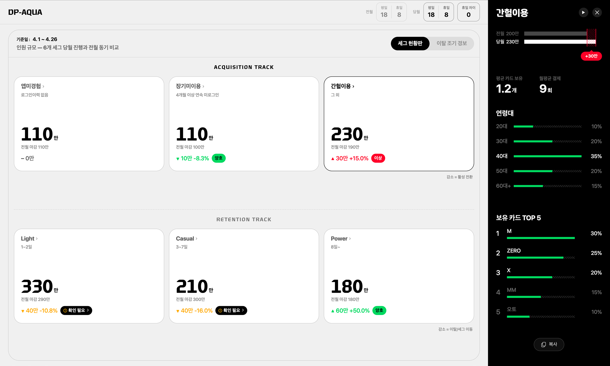

# Dashboard 슬라이드 디자인 가이드

`dashboard.html`을 기준으로 정리한 디자인 시스템 / 컴포넌트 / 사용 패턴 레퍼런스. 새 보고서를 같은 톤으로 만들고 싶을 때 이 문서를 참조해서 요건을 작성하거나 Claude에게 넘기면 된다.

---

## 1. 기본 사양

- 단일 HTML 파일에 27장 슬라이드 + JS/CSS 인라인. 폰트만 `../fonts/`에서 로컬 로드
- 캔버스 크기: **2040 × 1080px** 고정. JS가 뷰포트에 맞춰 scale + 위치 조정
- 다크/라이트 테마 토글 (`html.theme-dark` / `html.theme-light`)
- 다른 컴포넌트 추가 가능. 단 새로 만들지 말고 가능하면 기존 컴포넌트 재사용을 우선

---

## 2. 디자인 토큰 (CSS 변수)

### 색상 (다크 테마 기본값)
```
--bg: #080808            /* 슬라이드 배경 */
--surface: #141414       /* 카드/박스 배경 */
--surface-2: #1a1a1a     /* 카드 호버 등 */
--text: rgba(255,255,255,0.92)
--text-secondary: rgba(255,255,255,0.42)
--border: rgba(255,255,255,0.10)
--accent: #00D56D        /* 그린 (포인트) */
--accent-secondary: #FF0238  /* 레드 (네거티브) */
--soft-fill: rgba(255,255,255,0.06)  /* 그레이 면 */
--invert-bg: #000        /* 반전 헤더 (검정) */
--invert-text: #fff      /* 반전 헤더 텍스트 */
--discuss: #d33a3a       /* "논의 필요" 빨간 라벨 */
```

### 라이트 테마 (자동 반전)
```
--bg: #F5F5F3
--surface: #FFFFFF
--text: #111
--accent: #00b85e
--invert-bg: #000        /* 검정+흰 글자 그대로 (강조용) */
```

### 폰트 패밀리
- 본문/UI/숫자: `'SFProDisplay', sans-serif`
- 제목/큰 숫자: `'YouandiNewKrTitle', 'SFProDisplay', sans-serif`
- 폰트 파일: `../fonts/SF-Pro-Display-Medium.otf` / `Bold.otf` / `YouandiNewKrTitle-Bold.ttf`

### 폰트 스케일링
- 모든 폰트는 `font-size: calc(Npx * var(--font-scale))` 패턴
- `--font-scale` 기본값 1, 컨트롤로 0.7~1.5 조절
- **인라인으로 px 박는 건 피할 것** — 글로벌 스케일이 안 먹힘

---

## 3. 슬라이드 타입

각 슬라이드는 `<section class="slide [타입]">`. 슬라이드 자체는 `position:absolute; inset:0` + opacity 트랜지션.

| 타입 | 용도 | 핵심 구성 |
|---|---|---|
| `slide-cover` | 표지 | `cover-label` + `cover-title` + `cover-author` |
| `slide-doc` | 일반 문서 슬라이드 | `doc-title` + `doc-bullets` + 본문 |
| `slide-segments` | 세그 명칭/정의 표 | `seg-block` × N |
| `slide-intro` | 섹션 인트로 | `slide-intro-body` + 3카드 |
| `slide-eod` | 마지막 (감사합니다) | 큰 텍스트 중앙 |

---

## 4. 재사용 컴포넌트

### 4.1 헤더 / 타이틀

```html
<!-- 슬라이드 제목 (좌상단) -->
<h2 class="doc-title animate delay-1">제목</h2>

<!-- 불릿 리스트 (제목 아래) -->
<ul class="doc-bullets animate delay-2">
  <li>설명 1</li>
  <li class="hl">강조 항목 (그린 점)</li>
</ul>

<!-- 중앙 대문장 (큰 메시지) -->
<div class="head-center animate delay-2">한 줄 메시지</div>
```

### 4.2 카드 그룹

**3카드 가로 그리드 (인트로용):**
```html
<div class="intro-cards">
  <div class="intro-card animate delay-2">
    <h3>제목</h3>
    <p>설명</p>
  </div>
  <div class="intro-card animate delay-3">...</div>
  <div class="intro-card animate delay-4">...</div>
</div>
```

**라이프 사이클 카드 (검정 헤더 + 흰 바디):**
```html
<div class="lc-cards">
  <div class="lc-card">
    <div class="head"><span>FAI</span><span class="en">First Action Index</span></div>
    <div class="body">
      <div>본문 1</div>
      <div>본문 2</div>
    </div>
  </div>
  <!-- 반복 -->
</div>
```

**일반 박스 카드 (검정 헤더):**
```html
<!-- 1열 -->
<div class="bh1 animate delay-3">
  <div class="bhx-card">
    <div class="head">제목</div>
    <div class="body">
      <h4>소제목</h4>
      <ul><li>항목</li></ul>
    </div>
  </div>
</div>

<!-- 2열 -->
<div class="bh2 animate delay-3">
  <div class="bhx-card">...</div>
  <div class="bhx-card">...</div>
</div>
```

**RDI 식 카드 (가운데 정렬 + 하단 공식):**
```html
<div class="bh2">
  <div class="bhx-card rdi-card">
    <div class="head">루틴 RDI</div>
    <div class="body">
      <div class="lede">달성 조건</div>
      <p class="cond">조건 본문</p>
      <div class="formula-mini">RDI = ... * 100</div>
    </div>
  </div>
</div>
```

**BA 카드 (제목 + lede + 항목 리스트):**
```html
<div class="ba-cards animate delay-3">
  <div class="ba-card">
    <div class="head">직접 수익</div>
    <div class="body">
      <div class="lede">앱 이용으로 발생한<br>신규/증분 수익</div>
      <div class="items">
        <div class="label">주요 항목</div>
        <ul>
          <li>CA, CL, 리볼빙</li>
        </ul>
      </div>
    </div>
  </div>
</div>
```

**4패턴 카드 (OOO/XOO/OXO/XXO 같은 패턴 그리드):**
```html
<div class="pat4 animate delay-3">
  <div class="pat4-card">
    <div class="pat4-head">OOO</div>
    <div class="pat4-desc">3개월 연속 방문</div>
    <div class="pat4-stat">31% <small>+2%p</small></div>
    <div class="pat4-cnt">237만</div>
  </div>
  <!-- 4개 반복 -->
</div>
```

### 4.3 공식 박스

```html
<!-- 큰 공식 박스 (페이지 중앙용) -->
<div class="formula-box animate delay-3">
  <div class="formula">FAI = 온보딩 달성자 수 / 신규 회원 수<span class="star">*</span>100</div>
</div>

<!-- 공식 노트 (하단 보조 설명) -->
<div class="formula-notes animate delay-4">
  <p>온보딩 기능 달성자 수 = ...</p>
  <p>신규 회원 수 = 당월 앱 가입자 수</p>
</div>

<!-- 미니 공식 (rdi-card 내부) -->
<div class="formula-mini">루틴 RDI = 달성자 수 / 이용자 수 * 100</div>
```

### 4.4 라이프사이클 단계 (lc-stages)

```html
<div class="lc-stages animate delay-3">
  <div class="lc-stage">신규 사용자</div>
  <div class="lc-stage">정기 사용자</div>
  <div class="lc-stage">습관적 사용자</div>
</div>
```

### 4.5 비교 박스 (compare-rounded)

```html
<!-- 골드 톤 비교/예시 박스 -->
<div class="compare-rounded animate delay-3">
  내용
</div>
```

### 4.6 라벨 / 뱃지

```html
<span class="badge-discuss">논의 필요</span>  <!-- 빨간 pill -->
```

### 4.7 대시보드 이미지 (참고 화면)

```html
<div class="dash-wrap animate delay-3">
  
</div>
<p class="dash-cap animate delay-4">ex) 이미지 캡션</p>

<!-- 좌우 분할 (이미지 + 캡션) -->
<div class="dash-split">
  <div class="dash-side-img">
    
    <p class="dash-cap">캡션</p>
  </div>
  <div class="dash-text">설명 텍스트</div>
</div>
```

### 4.8 표 (구축 계획 등)

```html
<div class="attn-center">
  <table class="plan-table">
    <thead>
      <tr><th>버전</th><th>주기</th><th>지표</th><th>출처</th></tr>
    </thead>
    <tbody>
      <tr class="row-schedule">
        <td>...</td>
      </tr>
      <tr class="row-hl">
        <td>강조 행 (크림옐로우)</td>
      </tr>
    </tbody>
  </table>
</div>
```

### 4.9 세그 명칭 표 (커버 다음 슬라이드용)

```html
<div class="seg-block animate delay-2">
  <div class="seg-track-label">Acquisition</div>
  <table class="seg-table">
    <thead><tr><th>구분</th><th>A안</th><th>B안</th><th>C안</th><th>D안</th></tr></thead>
    <tbody>
      <tr><td>...</td><td>...</td></tr>
    </tbody>
  </table>
</div>
```

---

## 5. 레이아웃 wrapper

### attn-center
페이지 본문을 세로 중앙 정렬할 때 사용. flex column + justify-content: center + padding-bottom: 70.

```html
<section class="slide slide-doc">
  <h2 class="doc-title">제목</h2>
  <ul class="doc-bullets"><li>...</li></ul>
  <div class="attn-center">
    <!-- 카드/공식/박스 등 본문 -->
  </div>
</section>
```

### .bh1 / .bh2 / .pat4 / .lc-cards / .ba-cards
- `.bh1` — 단일 박스 (1열)
- `.bh2` — 2열 그리드 (gap: 36px)
- `.pat4` — 4열 그리드 (gap: 26px)
- `.lc-cards` — 3카드 균등 (lc 전용)
- `.ba-cards` — 3카드 균등 (BA 전용)

---

## 6. 애니메이션 시스템

```html
<element class="animate delay-1">...</element>
```

- `.animate` — `fadeInUp 0.55s ease-out` (아래에서 위로 페이드인)
- `.delay-1` ~ `.delay-8` — 0.1초 간격 지연
- 여러 요소를 순차적으로 등장시킬 때 `delay-1, delay-2, delay-3, ...`로 나눠서 적용
- **카드 그룹 안의 카드 각각**에 delay 다르게 줘서 카드가 하나씩 등장하는 효과 가능 (단, 너무 과한 stagger는 사용자가 어색하다고 함 — 슬라이드당 5~7개 정도가 적정)

---

## 7. 시스템 기능 (모든 슬라이드 공통)

### 키보드
- `←` / `→` / `Space` / `PgUp` / `PgDn` — 페이지 이동
- `Home` / `End` — 처음 / 마지막
- `T` — 다크/라이트 토글
- `↑` — 오버뷰 패널 열기 (썸네일 + 컨트롤)
- `↓` / `Esc` — 오버뷰 패널 닫기
- 인라인 편집 중: `Cmd/Ctrl+↑↓` — 폰트 크기, `Cmd/Ctrl+B` — 굵게, `Cmd/Ctrl+Enter` — 저장 종료, `Esc` — 취소

### 마우스
- 텍스트 클릭 → 인라인 편집 모드 진입 (편집 가능 leaf만)
- 호버 → 그린 아웃라인 (편집 가능한 가장 안쪽 요소만)

### 컨트롤 (오버뷰 패널 내)
- 전체화면
- 테마 토글
- 폰트 A− / 100% / A+
- PNG 다운로드
- Print
- HTML 내보내기 (인라인 편집 결과 포함)

### localStorage 키
- `dashboard-theme` — 다크/라이트 상태
- `dashboard-font-scale` — 글로벌 폰트 스케일
- `dashboard-edits-v3` — 인라인 편집 결과 (id별 innerHTML + fontSize)

**새 보고서로 클론할 때 키를 바꿔야 충돌 안 남:**
- 예: `dashboard-edits-v3` → `report-Q1-edits-v1` 등으로 rename

---

## 8. 의도된 비일관성 (보존 사항)

원본에 의도적으로 두 가지 표기가 공존하는 부분:
- VRI: page 6에서 "Visit Regularity Index", page 14에서 "Visit Recurrence Index" — 용어 후보 두 개를 일부러 노출
- LPI 정의 박스의 변수명은 LRI — 또 다른 후보

**새 보고서에선 이런 의도 없으면 한 가지로 통일.**

---

## 9. 27장 구성 사례 (현재 dashboard.html)

| 페이지 | 내용 | 컴포넌트 |
|---|---|---|
| 0 | 표지 | slide-cover |
| 1 | 세그 명칭 표 | slide-segments + seg-block |
| 2 | V.08 인트로 (3카드) | slide-intro + intro-cards |
| 3-4 | V.08 split (현황/이탈) | slide-doc + doc-bullets + dash-wrap |
| 5 | 야구 vs 카드앱 | head-center + compare-rounded |
| 6 | FAI/RDI/VRI 흐름 | head-center + lc-stages + lc-cards |
| 7-9 | FAI (정의/조건/대시보드) | doc-bullets + formula-box + bh1 + dash-wrap |
| 10-13 | RDI (정의/2동력/루틴+혜택/대시보드) | formula-box + bh1 + bh2.rdi-card + dash-wrap |
| 14-16 | VRI (정의/4패턴/대시보드) | formula-box + pat4 + dash-wrap |
| 17-20 | LPI (논의 필요) | badge-discuss + bh2 + pat4 + dash-wrap |
| 21-24 | BA (인트로/직접/비용절감/간접) | ba-cards + dash-split |
| 25 | 구축 계획 표 | plan-table |
| 26 | EOD | slide-eod |

**전형적 흐름:** 표지 → 인트로 → 본론(섹션별 4-5장) → 결론/계획 → EOD

**섹션 패턴:** "정의(공식 한 줄) → 측정 방식(2동력/4패턴) → 대시보드 화면" 3-4장

---

## 10. 새 보고서 만들기 워크플로우

### 사용자가 제공할 요건서 형식

```
보고서 제목: ___
청중: 상사 / 팀 / 외부
톤: 진행 보고 / 결론형 / 논의용 / 의사결정 요청

[슬라이드 1] 표지
- 큰 제목, 부제, 작성팀, 날짜

[슬라이드 2] 인트로 (3카드)
- 카드1: 제목 / 본문
- 카드2: 제목 / 본문
- 카드3: 제목 / 본문

[슬라이드 3] 핵심 메시지
- 한 줄 대문장

[슬라이드 4] 데이터 / 표
- 표 컬럼 / 행 정의

[슬라이드 N] EOD
```

### Claude의 작업
1. dashboard.html 복제 → 새 파일명
2. localStorage 키 rename (충돌 방지)
3. 슬라이드 27장 자리에 요건에 맞춰 재구성:
   - 같은 패턴이면 기존 컴포넌트 그대로 재활용
   - 새 패턴이면 같은 토큰으로 새 컴포넌트 추가
4. 카운터 (`5 / 27`) 자동 갱신
5. 이미지/차트는 placeholder로 두고 자료 받으면 임포트

### Claude가 자유롭게 결정해도 되는 영역
- 카드 수 / 레이아웃 패턴 (2열 / 3열 / 4열)
- 애니메이션 delay 분배
- 색상 강조 위치 (--accent 사용 빈도)
- bullet 강조 (`<li class="hl">`)

### Claude가 사용자 확인 받아야 하는 영역
- 슬라이드 개수 추가/삭제
- 의미 변경/요약/재작성
- 대규모 재구조 (섹션 합치기/분리)
- 새 컴포넌트 도입 (기존 컴포넌트로 안 풀리는 경우만)

---

## 11. 변경 이력 / 가이드 적용 규칙

이 가이드는 dashboard.html v0.8 (2026-04-28) 기준. 디자인 토큰이나 컴포넌트가 바뀌면 이 문서도 같이 업데이트할 것.

**Claude에게 새 보고서 요청 시 이 문서를 같이 첨부하면 디자인 톤 일관성 확보.**
